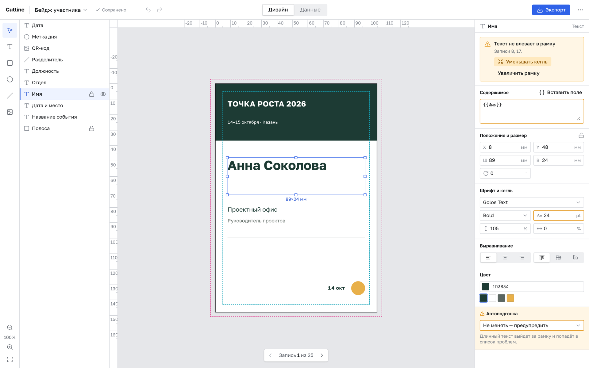
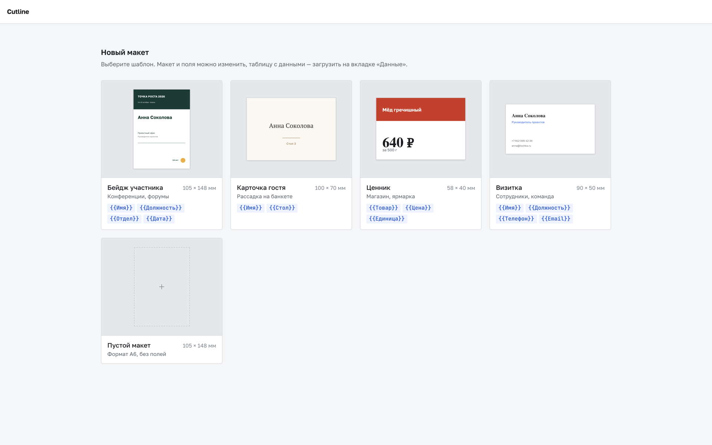
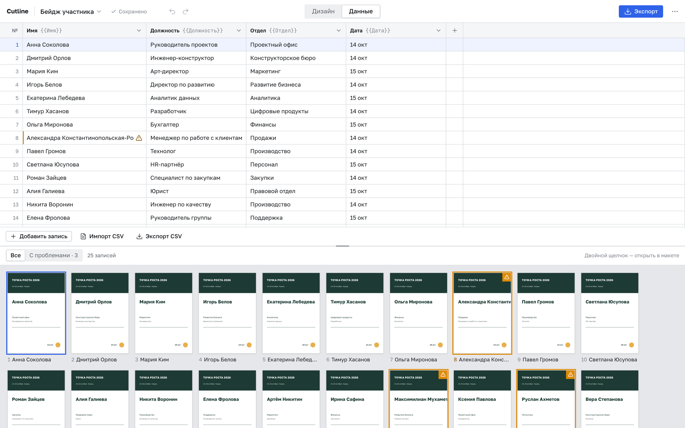
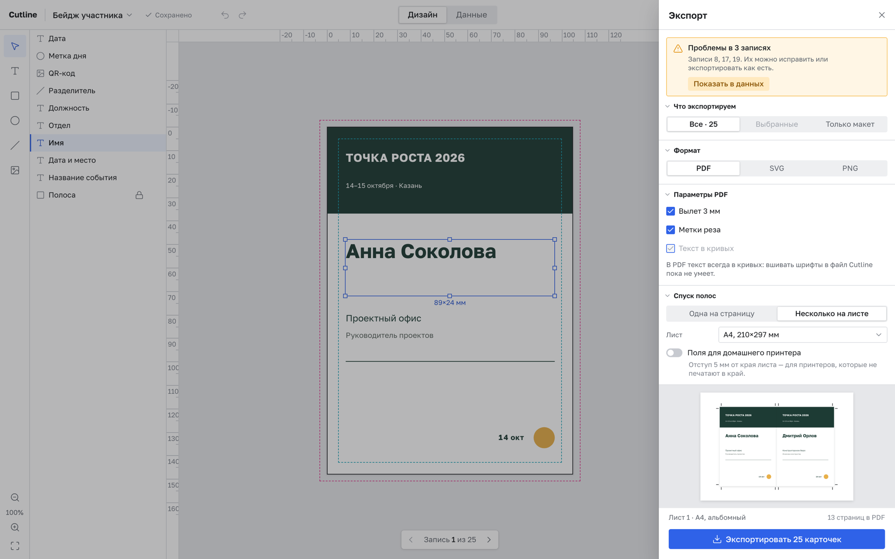

# Cutline

Конструктор печатных карточек с переменными данными. Один макет — много записей: бейджи для мероприятия, карточки гостей, номерки на столы, ценники, визитки.

**Попробовать:** https://redfur.github.io/cutline/ — работает в браузере, без регистрации и сервера.



## Зачем, если есть Canva и Figma

Общие редакторы отлично рисуют одну карточку и плохо делают двадцать пять разных. Здесь наоборот: рисование ровно такое, чтобы собрать свой макет, зато слияние с данными, защита вёрстки от длинных строк и печатный PDF — из коробки.

- **Слияние с данными.** Макет один, записей сколько угодно, подстановка через плейсхолдеры `{{Имя}}` — в тексте и в ссылке на картинку. Встроенные функции: QR-код `{{ qr(Ссылка) }}`, нумерация `{{ pad(n(), 3) }}` → 001, запасной текст `{{ default(Должность, "Гость") }}`, регистр, разряды в ценах.
- **Фиксированный размер.** Длинный текст ужимается по кеглю, переносится или обрезается по заданному правилу — карточка не меняет габариты никогда. Если что-то всё же не влезло, запись подсвечивается.
- **Готовность к типографии.** Вылеты, метки реза, текст в кривых, спуск полос на лист, поля для домашнего принтера.

## Как это выглядит

### С чего начать

Шаблон — бейдж участника, карточка гостя, ценник, визитка — или пустой лист A6. У каждого шаблона уже есть поля и пример таблицы.



### Данные

Таблица записей: колонки — это поля `{{…}}`, строки — будущие карточки. CSV импортируется с сопоставлением колонок и выгружается обратно. Снизу — все карточки разом; те, где текст не влез или пусто обязательное поле, обведены.



### Экспорт

PDF, SVG или PNG — всех записей или одного макета. PDF — с вылетом и метками реза, несколько карточек на листе A4/A3/SRA3; превью первого листа видно до выгрузки. PNG и SVG нескольких записей скачиваются одним ZIP.



## Пример: бейджи на мероприятие

1. На стартовом экране выберите «Бейдж участника».
2. Во вкладке **Данные** нажмите «Импорт CSV» и загрузите список участников, например:

   ```csv
   Имя,Должность,Отдел,Дата
   Анна Соколова,Руководитель проектов,Проектный офис,14 окт
   Дмитрий Орлов,Инженер-конструктор,Конструкторское бюро,14 окт
   ```

   Колонки сопоставляются с полями `{{Имя}}`, `{{Должность}}`, `{{Отдел}}`, `{{Дата}}`; колонку, которой нет в макете, можно завести новым полем или не импортировать.
3. Посмотрите на сетку: обведённые карточки — те, где имя не влезло. Выберите элемент на вкладке **Дизайн** и включите «Уменьшать кегль» или увеличьте рамку.
4. **Экспорт → PDF → Несколько на листе**, лист A4. Для домашнего принтера включите «Поля для домашнего принтера» — Cutline предложит уменьшить карточки, чтобы их влезло столько же.

Свой макет собирается инструментами слева (текст, прямоугольник, эллипс, линия, картинка): привязки к краям, центру и другим элементам, направляющие с линеек, undo/redo, слои с замком и видимостью.

## Где хранятся данные

Всё — в браузере, в IndexedDB: документы сохраняются сами через полсекунды после правки, их можно переключать, дублировать и удалять из списка в шапке. На сервер ничего не уходит. Чтобы перенести макет на другой компьютер, сохраните его файлом (меню «…» → «Сохранить в файл») и откройте там же через «Открыть файл…».

## Шрифты

В поставке — четыре открытых шрифта (OFL): Golos Text, Manrope и JetBrains Mono в начертаниях Regular, Medium, SemiBold и Bold, PT Serif — Regular и Bold. Только они попадают в PDF: текст переводится в кривые, поэтому типографии шрифт не нужен. Системные шрифты можно использовать на экране, в SVG и PNG, но не в PDF — экспорт честно скажет, какой слой мешает.

## Разработка

```bash
npm install
npm run dev      # dev-сервер Vite
npm test         # Vitest
npm run lint     # Biome
npm run build    # проверка типов и сборка в dist/
```

Сайт собирается и публикуется на GitHub Pages workflow-ом `.github/workflows/ci.yml` при каждом push в `main`; на pull request гоняются lint, тесты и сборка.

### Стек

- React + TypeScript, сборка через Vite
- Своя история изменений (`src/editor/lib/history.ts`) — без стейт-менеджеров
- Рендеринг в SVG: попадание курсора решается средствами DOM, экспорт совпадает с экраном
- opentype.js — текст в кривые, pdf-lib — сборка PDF, fflate — ZIP; все три грузятся лениво, только при экспорте
- idb-keyval — хранение в IndexedDB

### Структура

```
src/
  model/       схема документа, валидация, миграции
  render/      чистая функция (документ, запись) → SVG, раскладка текста, кривые
  editor/      холст, инструменты, инспектор, слои, данные, экспорт, стартовый экран
  data/        плейсхолдеры, проблемы записей, CSV — чистые функции без DOM
  export/      SVG, PNG, PDF, спуск на лист, пакетная сборка
  fonts/       встроенные OFL-шрифты и их загрузка
  storage/     документы в IndexedDB, автосохранение
  templates/   шаблоны стартового экрана
  ui/          порт дизайн-системы (кнопки, поля, панели)
docs/
  document-model.md   схема документа
  roadmap.md          этапы и задачи
  ui-spec.md          раскладка экранов
reference/
  badge-editor-v1.html  рабочий прототип, от которого отталкивались
```

## Принципиальные решения

**Миллиметры внутри, пиксели только при показе.** Вся геометрия документа в миллиметрах. Иначе накопятся расхождения между экраном и печатью.

**Рендерер — чистая функция.** Ни одного обращения к DOM редактора. Из этого бесплатно получаются превью, сетка миниатюр, экспорт и пакетная генерация. PDF собирается из того же SVG.

**Одно измерение текста.** Экран, проверка переполнения и кривые в PDF меряют текст одинаково, поэтому то, что влезло на экране, влезет и на печати.

**Схема документа версионирована.** Старый файл открывается новой версией через миграции.

## Лицензия

MIT
